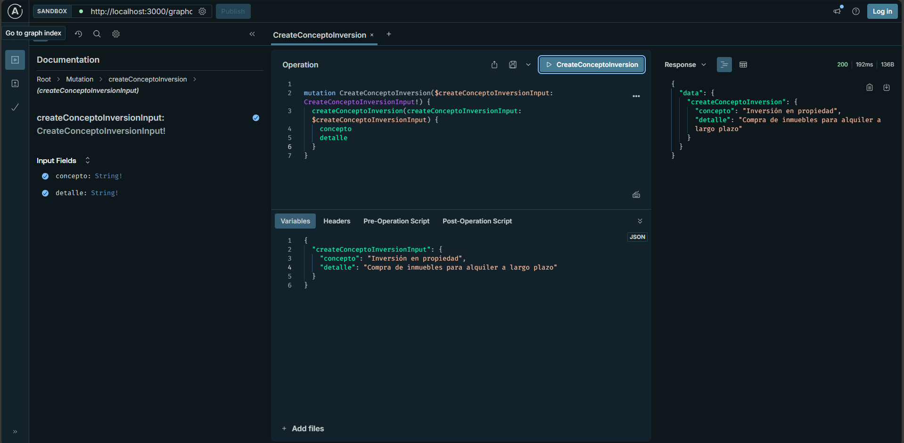
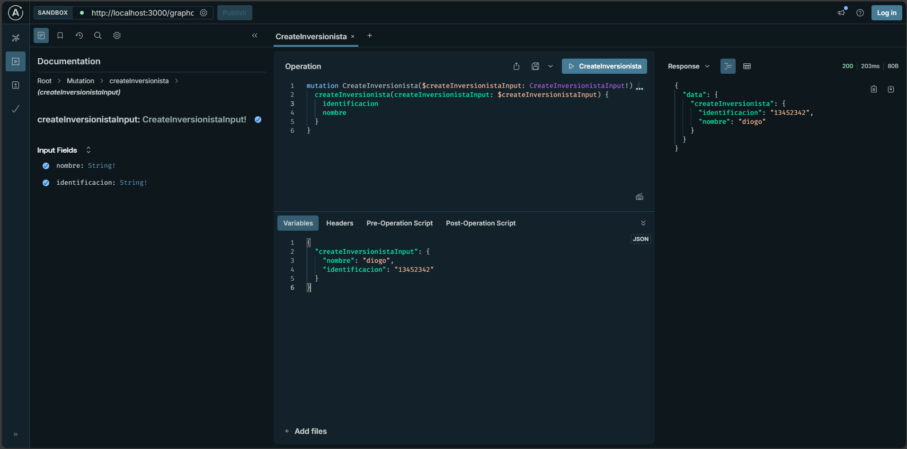
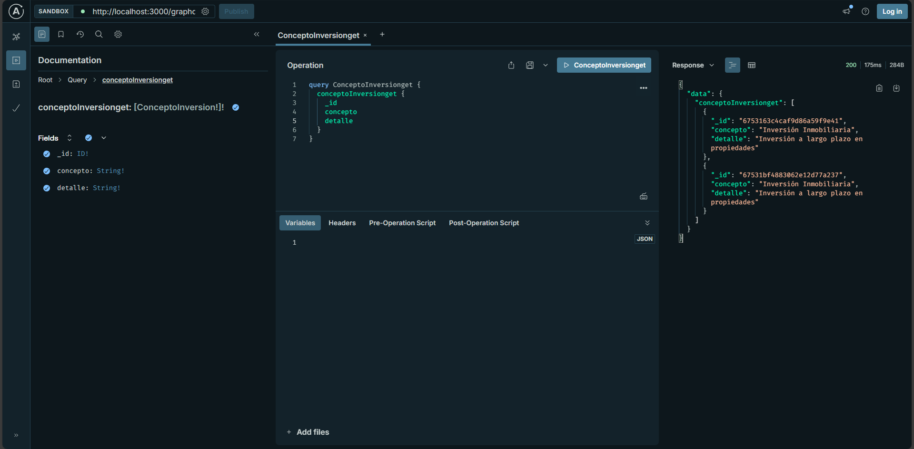
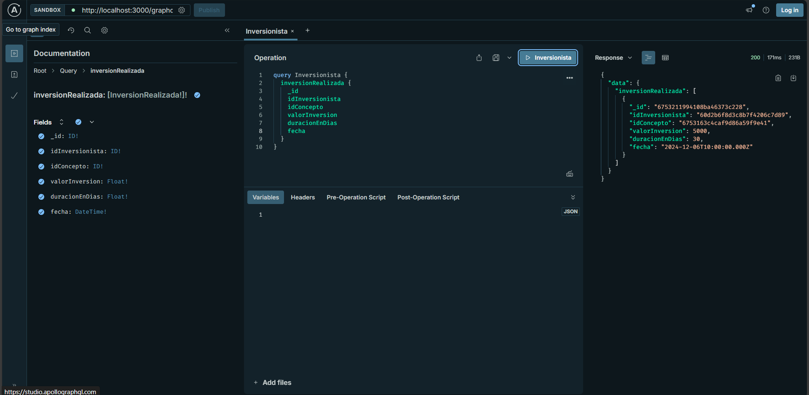
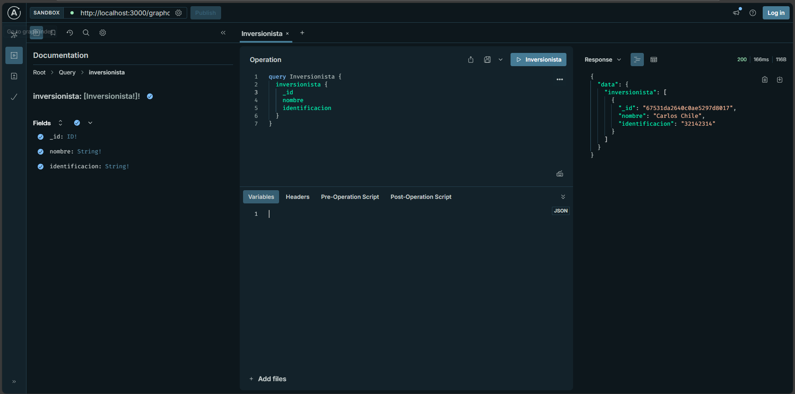

# Proyecto API con TypeORM y PostgreSQL

### 1. Instalación de dependencias
npm install 
npm install mysql2 @nestjs/graphql

### 2. Inicializa servidor 
npm run start:dev

### Imágenes:

1. **Mutacion Concepto:**

2. **Mutacion Inversionista:**

2. **Mutacion Inversion realizada:**

1. **Query Concepto:**

2. **Query Inversion:**

3. **Query Inversionista:**

